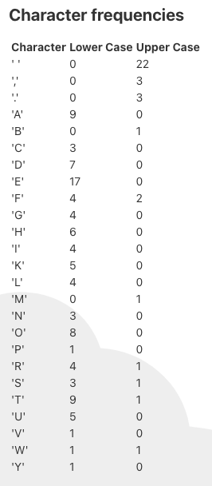

= Programming tasks
:icons: font
:icon-set: far
:source-highlighter: highlightjs

This project contains a basic TODO application built with Angular and TypeScript.
Nevertheless, the tasks are constructed so as to not require any prior knowledge of either Angular or TypeScript, but can be solved with only JavaScript knowledge and a basic understanding of Node.js and NPM.

To get the project up and running, please follow the instructions in the link:../README.adoc[README.adoc] file.

== Checking your results

If you start the application by running
[source, sh]
----
npm run start
----
and open it in the browser (http://localhost:4200[]), then it will update automatically whenever you save any changes to a file within the project.

This allows you to check your results as you build them.

== How does the project work?
Initially the application will look something like this:

image::01.png[The initial state of the application]

NOTE: In the following cases the links go to the TypeScript files for components. Angular splits a component into a TypeScript file, a HTML template and an optional style file (here: an SCSS file); you may have to check all three to understand how the component works.

=== The visual components
We can see here, that there is a component for adding a new TODO item (the link:../src/app/add-item/add-item.component.ts[AddItemComponent]), three headers by which items could be sorted (defined in the link:../src/app/list-header/list-header.component.ts[ListHeaderComponent]) and a list of TODO items (as defined in the link:../src/app/todo-list/todo-list.component.ts[TodoListComponent]).
The list contains a number of items (implemented in the link:../src/app/todo-item/todo-item.component.ts[TodoItemComponent]), as well as two inputs (a checkbox icon:check[], and a trash button icon:trash[]) for items that have not been deleted and a crossed out sign icon:ban[] for deleted items.

In addition to these components, there is also a histogram (link:../src/app/histogram/histogram.component.ts[HistogramComponent]), which is situated below the TODO item list but is empty at the moment.
This will become relevant during the programming tasks.

=== Predefined data
The three predefined items are created in the link:../src/app/items.service.ts[ItemService] as follows:
[source, typescript]
----
this.todoListItems.push({
  title: 'Walk the dog',
  description: 'Take Rufus, the dog, out for a walk in the park.',
  status: TodoItemStatus.Open,
});
this.todoListItems.push({
  title: 'Feed the cat',
  description: 'Feed Marge, the cat. She likes goose liver.',
  status: TodoItemStatus.Done,
});
this.todoListItems.push({
  title: 'Buy catfood',
  status: TodoItemStatus.Deleted,
});
----

== Task 1: Sorting the items
There are three sorting headers defined, none of which currently work.
Your task is to implement the sorting algorithm, which is defined in and called from the link:../src/tasks/sortItems.js[src/tasks/sortItems.js] file:
[source, typescript]
----
/**
 * Sort the items in the given list.
 * 
 * @param {boolean} ascending Should the items be sorted in ascending or descending order?
 * @param {string} sortBy Can be "title", "description", or "status"
 * @param {TodoListItem[]} items to be sorted. Each element of the list contains a "title" (string), an optional "description" (string or undefined) and a numerical status.
 */
function sortItems(ascending, sortBy, items) {
  // TODO Implement a sorting function
}

export { sortItems };
----

As you can see, a single function is contained in this file: `sortItems`.
This function takes three parameters:

- a boolean value called `ascending`, which will be `true` if the items should be sorted in ascending order (A -> Z) or `false` if they should be sorted in descending order (Z -> A)
- a string value called `sortBy` which will be one of the three values `'title'`, `'description'`, or `'status'`, depending on which of the three sorting headers is being used
- a list of objects `items`, where each item has the fields `title` (a string), `status` (an enum which will be `Open`, `Done`, or `Deleted`) and an optional string field `description`

The function does not have a return value, but will sort the items in place; so the `items` array must be manipulated.

NOTE: The `sortItems` function is called in the link:../src/app/list-header/list-header.component.ts[ListHeaderComponent], specifically in the `sortItemsBy` function. This in turn is called from within the link:../src/app/list-header/list-header.component.html[ListHeaderComponent HTML template]. You do not however have to edit anything outside of the `sortItems` function to solve this task.

=== Your task
Implement the function to sort the items as described above.

Once the task is solved, the items should be sortable by the title when clicking on the "Sort by title" button, by description by clicking the "Sort by description" button, and by status by clicking the "Sort by status" button.

TIP: Also think about how to deal with cases, where two items seem to be equal - especially when sorting by status. How could such cases be handled?

== Task 2: Better visualization

Currently, the status of items can be differentiated by the checkbox status and icon next to them; an unchecked checkbox and a trash bin means it's `Open`, a checked checkbox and a trash bin icon:trash[] means it's `Done`, and a crossed out icon icon:ban[] means that it is `Deleted`.

This works, but there is room for improvement.
In addition to those icons, the items (specifically divs within the link:../src/app/todo-item/todo-item.component.html[TodoItemComponent HTML template]) also have CSS classes matching those statuses (`"open"`, `"done"`, and `"deleted"`).
(The crossed out icon icon:ban[] also has the `"deleted"` class, though this is defined elsewhere.)

=== Your task

Use these CSS classes (e.g. by adding to the link:../src/styles.scss[src/styles.scss] file) to make he current status of an item more apparent and easier to recognize.

NOTE: Angular also has component specific SCSS files; if you prefer, you can edit those instead.
The relevant files here would be the link:../src/app/todo-item/todo-item.component.scss[TodoItemComponent SCSS file] and possibly the link:../src/app/todo-list/todo-list.component.scss[TodoListComponent SCSS file].
Changes within these files will only apply to their respective components.

== Task 3: Counting the characters

Hidden for now, under the TODO list is an instance of the link:../src/app/histogram/histogram.component.ts[HistogramComponent].
This should display, how often which character has been used in the existing items (in any status) so far.
For the initial items, the completed histogram should look like this:

Once again, the logic for this has been extracted into a separate file: link:../src/tasks/countCharacters.js[src/tasks/countCharacters.js].
The file looks like this:
[source, typescript]
----
/**
 * Count the frequency of each character in both the title and the description of a todo list item.
 * 
 * @param {TodoListItem} item Newly added item. It contains a "title" (string), an optional "description" (string or undefined) and a numerical status. The status is irrelevant to this task.
 * @param {CharacterFrequencies} previousData An object in the form { character: { upperCase: number, lowerCase: number } }, containing the values calculated to far.
 * @returns An object in the form { character: { upperCase: number, lowerCase: number } }, containing new total numbers.
 */
function countCharacters(item, previousData) {
  // console.log({
  //   task: 'Counting characters',
  //   item,
  //   previousData,
  // });

  const newData = {
    // A: {
    //   upperCase: 1,
    //   lowerCase: 2,
    // },
    // B: {
    //   upperCase: 2,
    //   lowerCase: 4,
    // },
  };

  return newData;
}

export { countCharacters };
----

Once again, we have only one function in this class: the `countCharacters` function.
It receives:

- an `item` object (which has the same format as a single item of the `items` array used in <<Task 1: Sorting the items>>)
- a `previousData` object, contains a key for each character used so far (in upper case) with a value of the format `{ upperCase: number, lowerCase: number }`

So for example, if we had previously only had item with the title `"BAB"` and the description `"abbabb"`, the `previousData` object would be equal to:
[source, typescript]
----
{
 A: {
   upperCase: 1,
   lowerCase: 2,
 },
 B: {
   upperCase: 2,
   lowerCase: 4,
 },
}
----
The function is expected to return an object which represents the complete new state (so including the data from `previousData` and the newly counted characters).

The `countCharacters` function is called

- initially when the application loads (thereby filling the `previousData` object)
- each time a new item is added

The resulting `newData` object is then displayed by the HistogramComponent in the way shown above.

=== Your task

Implement this function, so that it adds the characters from both the title and the description of any item that is passed to it.

== Task 4: Designing the application

The project we have so far is an early prototype for a TODO application; while it works, there is obviously a lot to be done before it could be presented to an end user.

Imagine that this should become a full product to be used by the people in human resources departments.
Long term, it should help those people coordinate job applications, invitations to job interviews, job offers, etc.
Those tasks should also be sharable and assignable within the human resources team.

=== Your task

Create a mockup for the future main page of this TODO application.
You will be presenting this mockup during your interview.
Additional information will be provided to you in a separate document (not included in this repository).